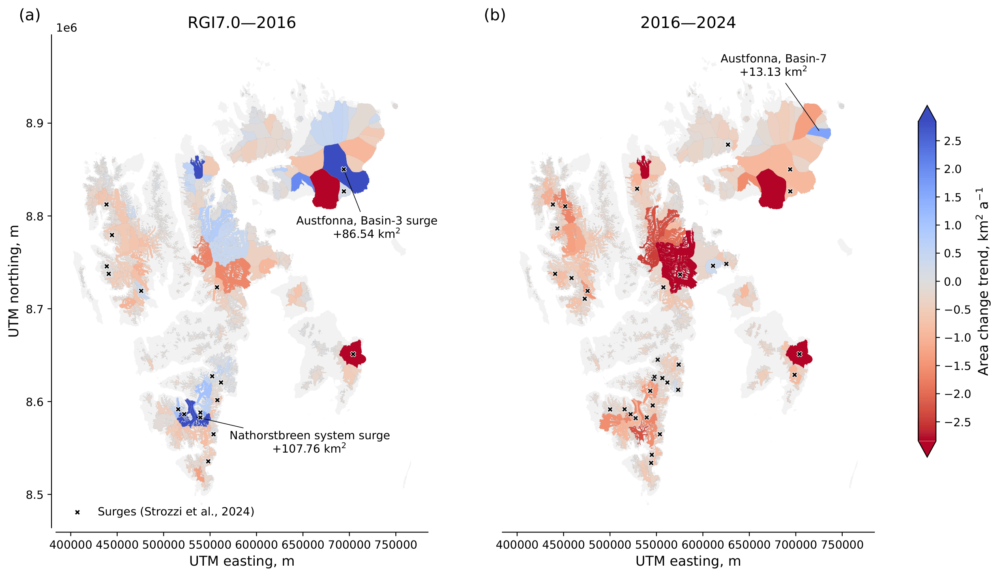

# ICEmapper

[Konstantin A. Maslov](https://people.utwente.nl/k.a.maslov), [Thomas Schellenberger](https://www.mn.uio.no/geo/english/people/aca/geohyd/thosche/), [Claudio Persello](https://people.utwente.nl/c.persello), [Alfred Stein](https://people.utwente.nl/a.stein)

[[`Paper`](https://doi.org/10.31223/X5472T)] [[`Datasets`](#datasets)] [[`BibTeX`](#citing)] 

<br/>



The rapid warming in polar regions highlights the need to monitor climate change impacts such as glacier retreat and related global sea level rise. 
Glacier area is an essential climate variable but its tracking is complicated by the labour-intensive manual digitisation of satellite imagery.
Here we introduce ICEmapper, a deep learning model that maps glacier outlines from Sentinel-1 time series with accuracy on par with human experts.
We used this model to retrieve Svalbard glacier outlines for 2016&ndash;2024 and found a tripling of the glacier area loss rate in the last decade (-227 km<sup>2</sup> a<sup>-1</sup>) as compared to that of 1970&ndash;2006 (-68 km<sup>2</sup> a<sup>-1</sup>). 
Our analysis shows significant area changes related to glacier surging, namely, the Nathorstbreen system and Austfonna, Basin-3 surges. 
These two surges collectively added to the area change in 2006&ndash;2016 (+194.30 km<sup>2</sup> or +0.60%), thus delaying the regionwide area loss by two&ndash;three years. 
In contrast, during 2016&ndash;2024, surging glaciers showed statistically significantly faster area loss rates than non-surging glaciers.
Our results indicate a significant acceleration in glacier area loss in Svalbard, and we anticipate broader applications of our method to track glacier changes on larger scales. 

<br/>

## Data access


## Getting started


## Pretrained models

Luckily, the number of parameters is small enough, so the weights are directly deposited in this repository. 
You will find them in [the weights folder](weights). 
The file names follow the template `ICEmapper_<maxpool|tweightedpool>_<FEATURES,>.h5`. 


## License

This software is licensed under the [GNU General Public License v2](LICENSE).


## Ice divides

We moved the algorithms for ice divides reconstruction to [a different repository](https://github.com/konstantin-a-maslov/massive_ice_divides).


## Citing

**!To be updated once the journal paper is published!**

To cite the paper/repository, please use the following bib entry. 

<!-- TODO: Update BibTeX once published in a journal```
@article{INDEX,
    title={TITLE},
    author={Maslov, Konstantin A. and Schellenberger, Thomas and Persello, Claudio and Stein, Alfred},
    journal={},
    year={YEAR},
    volume={},
    number={},
    pages={},
    doi={}
}
``` -->
```
@article{icemapper2025,
    title={Three times accelerated glacier area loss in Svalbard revealed by deep learning},
    author={Maslov, Konstantin A. and Schellenberger, Thomas and Persello, Claudio and Stein, Alfred},
    year={2025},
    archivePrefix={EarthArXiv},
    doi={10.31223/X5472T},
    url={https://doi.org/10.31223/X5472T},
}
```
